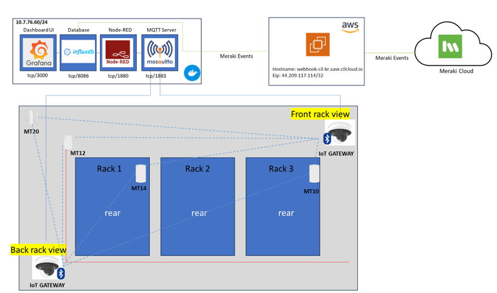

# Meraki DC Monitoring
Meraki DC Monitoring 
## Descrição
Variações de temperatura, umidade e vazamentos de líquidos podem comprometer a infraestrutura de um Data Center e interromper os serviços hospedados nele. Os sensores da Meraki oferecem uma visão detalhada dessas variáveis ambientais, antes inacessíveis aos times de TI. Esta demonstração tem como objetivo ampliar as funcionalidades dos sensores, fornecendo informações adicionais obtidas de câmeras, redes e plataformas de terceiros.

## Objetivos
1.	Detecção de abertura/fechamento da porta do DC no decorrer do tempo
2.	Detecção da entrada de pessoas (quantidade / local de acesso / tempo de permanência)
3.	Correlação armário acessado x componentes do armário x possíveis áreas afetadas – Gestão de mudanças e riscos 
4.	Medição de Temperatura do ambiente e comportamento após abertura da porta 
5.	Medição da Temperatura e Humidade do Ambiente no decorrer do tempo
6.	Medição de Vazamento de Água no Ambiente no decorrer do tempo
7.	Medição do Consumo Energético no decorrer do tempo
8.	Integração com ServiceNow para abertura de Ticket

## BOM 
| Dispositivo/Licença |	Quantidade |
|---------------------|------------|
|Sensor Meraki MT40 |	1 |
|Sensor Meraki MT12 |	1|
|Sensor Meraki MT20 |	1|
|Sensor Meraki MT14 |	2|
|Câmera Meraki MV12 |	2|
|Switch Catalyst 9300 |	2|
|Licença ServiceNow | 	1|

## Arquitetura

